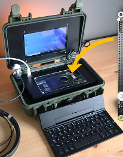
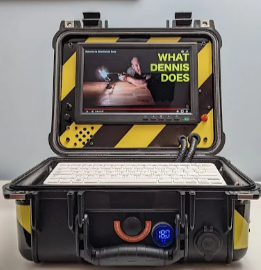
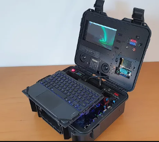
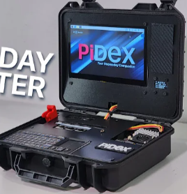

### **Self-sufficient Artificial Intelligent Raspberry Pi Assistant**

SAIPiA is a self-sufficient system built on a Raspberry Pi that features an AI assistant capable of performing various tasks, including database access, LLMs (Large Language Models), image recognition, speech recognition, and image generation. 

The entire system is housed in a secure case, containing the Raspberry Pi, a display, a keyboard, and other peripherals. It is powered by an internal battery that can be recharged via USB-C. All Raspberry Pi interfaces, including GPIO pins, are accessible. An AI kit is used to optimize tasks for the Raspberry Pi.

---

## 1. Introduction and Objectives

**Objective**  
The goal is to develop a self-sufficient system that offers AI assistant capabilities in a portable and user-friendly format. Additionally, the system allows for the control of external actuators through the GPIO pins.

**Motivation**  
To provide a flexible, versatile tool for developers, researchers, or emergency responders in remote or network-independent environments.

---

## 2. System Architecture and Hardware Components

**Hardware Overview**  
- **Raspberry Pi Model**: Raspberry Pi 5 or equivalent
- **AI Kit**: To optimize processing for neural networks (e.g., Google Coral USB Accelerator)
- **Display**: 7-inch touchscreen
- **Input Devices**: Keyboard, mouse
- **Internal Power Supply**: Battery (e.g., 10,000 mAh), rechargeable via USB-C
- **Interface Access**: Full access to all Raspberry Pi interfaces (GPIO, HDMI, USB)

**Security Case**  
- **Design**: Rugged, portable case with enough space for all components
- **Access**: Direct access to all Raspberry Pi interfaces
- **Cooling and Ventilation**: Adequate ventilation to prevent overheating

---

## 3. Software Architecture and Functions

**Core Software**  
A Linux-based operating system is used, which is user-friendly and easily customizable. The necessary interfaces for AI functionalities and hardware control will be implemented.

**AI Features**  
- Database access
- Implementation of language models like LLAMA
- Image and speech recognition
- Image generation

**Optimization**  
By using specialized AI kits (such as Google Coral), the system's processing speed for neural networks is improved, allowing efficient handling of AI models.

---

## 4. Use Cases

- **Education**: A learning platform for AI and robotics courses
- **Research**: Use in research projects for data collection and analysis in remote areas
- **Development**: A development platform for AI applications
- **Disaster Relief and Rescue**: Used in areas without network connectivity, where local data processing is crucial

---

## 5. Milestones

1. **Hardware Framework & Initial Software Integration** (September 30, 2024)  
   Initial hardware and software components are connected and operational.
   
2. **AI Software Integration & OS Stability** (October 15, 2024)  
   First implementation of AI functionalities is completed, and the OS runs stably.

3. **Prototype & UI Testing** (November 15, 2024)  
   First hardware prototype is complete, and initial UI tests are conducted.

4. **Hardware Optimization & UI Finalization** (December 10, 2024)  
   Hardware components are optimized, and the AI assistant's user interface is ready.

5. **Final AI Implementation & System Stability** (January 31, 2025)  
   Final AI features are implemented, and the system is ready for deployment.

---

## 6. Risks and Challenges

- **Hardware Limitations**: Limited processing power of the Raspberry Pi
- **Power Consumption**: Optimizing battery life
- **Network Independence**: Ensuring all necessary data and models are available locally

---

## 7. Further Research

- **AI Kit Compatibility**: Investigating current AI kits and their integration with the Raspberry Pi
- **LTE Modules**: Exploring the possibility of integrating LTE modules for emergency communication

---

## 8. Server and Server Implementation (Dedicated Server)

An external server will be used to support AI functionalities by expanding the computing power. The server processes complex AI models, relieving the Raspberry Pi.

**Server Requirements**  
- **OS**: Ubuntu 22.04 LTS or higher
- **Processor**: At least 8 cores
- **RAM**: 16 GB or more
- **Graphics Card**: High-performance GPU (e.g., NVIDIA A100 or RTX 3090)
- **Storage**: ~1 TB SSD for models and data

**Server Implementation**  
1. **Model Hosting**  
   The server hosts larger AI models (e.g., LLAMA3.2) and processes requests from the Raspberry Pi. A smaller model on the Pi determines which requests are sent to the server.

2. **Communication**  
   The Raspberry Pi communicates with the server through a RESTful API. The server processes requests and returns the results.

3. **Load Balancing**  
   Additional server instances are scaled as needed to avoid overloading.

4. **Security Measures**  
   Encryption of all data transmissions and firewall implementation.

5. **Monitoring**  
   Tools like Prometheus monitor the server's state (CPU, RAM, GPU).

**Benefits of the Server Architecture**  
By integrating a server, the overall system’s processing power is significantly increased. Computationally intensive tasks are delegated to the server, while the Raspberry Pi handles local processes and simpler tasks.

---

### 8.1 School AI Server

The school's AI server is provided for development and testing of AI models. It offers higher computing power than the self-hosted server, allowing the use of powerful models. The advantage is that the server is already available and incurs no additional costs. However, since multiple users share the server, resources must be divided, which may lead to longer wait times and fluctuations in performance.

---

## 9. Summary

SAIPiA is a self-sufficient Raspberry Pi-based system that functions as a versatile AI assistant. It includes hardware components such as an AI kit, display, and input devices housed in a robust security case. The software architecture enables features such as database access, speech and image recognition, and image generation. The system is designed for various applications, including education, research, and disaster relief. An external server enhances computational power for complex AI models. The development follows multiple milestones, addressing challenges such as hardware limitations and power consumption. Further research includes AI kit integration.

---

## 10. Concept Images

  
  
  

