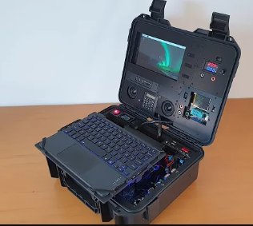

  
**Self-sufficient Artificial Intelligent Raspberry Pi Assistant**

SAIPiA ist ein autarkes System, das auf einem Raspberry Pi basiert und einen AI-Assistenten beinhaltet, der eine Vielzahl von Funktionen erfüllen kann, wie z.B. den Zugriff auf Datenbanken, LLMs (Large Language Models), Bilderkennung, Spracherkennung und Bildgenerierung.  

Das gesamte System ist in einem Sicherheitskoffer untergebracht, der einen Raspberry Pi, ein Display, eine Tastatur und andere Peripheriegeräte enthält. Es wird von einem internen Akku betrieben, der über USB-C aufgeladen werden kann. Alle Schnittstellen des Raspberry Pi, einschließlich der GPIO-Pins, sind zugänglich. Zur Optimierung der Aufgaben wird ein AI-Kit für den Raspberry Pi verwendet.

## 1. Einleitung und Zielsetzung

**Zielsetzung**  
Die Entwicklung eines autarken Systems, das die Fähigkeiten eines AI-Assistenten in einem portablen und benutzerfreundlichen Format bietet. Das System bietet zudem die Möglichkeit, externe Aktoren über die GPIO-Pins anzusteuern.

**Motivation**  
Die Bereitstellung eines flexiblen, vielseitigen Werkzeugs für Entwickler, Forscher oder Einsatzkräfte in abgelegenen oder netzwerkunabhängigen Umgebungen.

## 2. Systemarchitektur und Hardwarekomponenten

**Hardwareübersicht**  
- **Raspberry Pi Modell**: Raspberry Pi 5 oder vergleichbar
- **AI-Kit**: Zur Optimierung der Rechenleistung für neuronale Netzwerke (z.B. Google Coral USB Accelerator)
- **Display**: 7-Zoll-Touchscreen
- **Eingabegeräte**: Tastatur, Maus
- **Interne Stromversorgung**: Akku (z.B. 10.000 mAh), aufladbar via USB-C
- **Schnittstellenzugang**: Zugriff auf alle Schnittstellen des Raspberry Pi (GPIO, HDMI, USB)

**Sicherheitskoffer**  
- **Design**: Robuster, tragbarer Koffer mit ausreichendem Platz für alle Komponenten
- **Zugriff**: Direkter Zugang zu allen Schnittstellen des Raspberry Pi
- **Kühlung und Belüftung**: Ausreichende Belüftung zur Vermeidung von Überhitzung

## 3. Softwarearchitektur und Funktionen

**Kernsoftware**  
Ein Linux-basiertes Betriebssystem wird verwendet, das benutzerfreundlich ist und leicht angepasst werden kann. Die nötigen Schnittstellen für AI-Funktionen und Hardwaresteuerung werden implementiert.

**AI-Funktionen**  
- Zugriff auf Datenbanken
- Implementierung von Sprachmodellen wie LLAMA
- Bild- und Spracherkennung
- Bildgenerierung

**Optimierung**  
Durch den Einsatz von speziellen AI-Kits (wie Google Coral) wird die Verarbeitungsgeschwindigkeit von neuronalen Netzwerken erhöht, sodass das System KI-Modelle effizient verarbeiten kann.

## 4. Use Cases / Verwendungszwecke

- **Bildung**: Lernplattform für KI- und Robotik-Kurse
- **Forschung**: Verwendung in Forschungsprojekten zur Datensammlung und -analyse in abgelegenen Gebieten
- **Entwicklung**: Entwicklungsplattform für KI-Anwendungen
- **Katastrophenschutz und Rettung**: Einsatz in Gebieten ohne Netzwerkanbindung, wo lokale Datenverarbeitung wichtig ist

## 5. Milestones

1. **Hardware-Framework & Initial Software Integration** (30. September 2024)  
   Erste Hardware- und Softwarekomponenten sind verbunden und betriebsfähig.
   
2. **AI-Software Integration & Betriebssystemstabilität** (15. Oktober 2024)  
   Die erste Implementierung von AI-Funktionalitäten ist abgeschlossen. Das Betriebssystem läuft stabil.

3. **Prototyp & UI-Tests** (15. November 2024)  
   Der erste Hardware-Prototyp ist fertig. Erste UI-Tests werden durchgeführt.

4. **Hardware-Optimierung & Finalisierung der UI** (10. Dezember 2024)  
   Hardware-Komponenten sind optimiert und die Benutzeroberfläche des AI-Assistenten ist einsatzbereit.

5. **Finale AI-Implementierung & Systemstabilität** (31. Januar 2025)  
   Die finalen AI-Funktionen sind implementiert und das System ist bereit für den Einsatz.

## 6. Risiken und Herausforderungen

- **Hardware-Einschränkungen**: Begrenzte Rechenleistung des Raspberry Pi
- **Energieverbrauch**: Optimierung der Akkulaufzeit
- **Netzwerkunabhängigkeit**: Sicherstellen, dass alle benötigten Daten und Modelle lokal verfügbar sind

## 7. Weiterer Forschungsbedarf

- **AI-Kit-Kompatibilität**: Untersuchung aktueller AI-Kits und deren Integration in den Raspberry Pi
- **LTE-Module**: Untersuchung der Möglichkeit, LTE-Module zur Notfallkommunikation zu integrieren

## 8. Server und Serverimplementierung (eigener Server)

Zur Unterstützung der KI-Funktionen wird ein externer Server verwendet, um die Rechenleistung zu erweitern. Der Server verarbeitet komplexe AI-Modelle und entlastet den Raspberry Pi.

**Serveranforderungen**  
- **Betriebssystem**: Ubuntu 22.04 LTS oder höher
- **Prozessor**: Mindestens 8 Kerne
- **RAM**: 16 GB oder mehr
- **Grafikkarte**: Leistungsstarke GPU (z.B. NVIDIA A100 oder RTX 3090)
- **Speicherplatz**: ~ 1 TB SSD für Modelle und Daten

**Serverimplementierung**  
1. **Hosting der Modelle**  
   Der Server hostet größere AI-Modelle (z.B. LLAMA3.2) und verarbeitet Anfragen des Raspberry Pi. Ein kleineres Modell auf dem Pi entscheidet, welche Anfrage an den Server weitergeleitet wird.

2. **Kommunikation**  
   Der Raspberry Pi kommuniziert über eine RESTful API mit dem Server. Der Server verarbeitet die Anfragen und liefert die Ergebnisse zurück.

3. **Load-Balancing**  
   Um eine hohe Auslastung zu vermeiden, werden bei Bedarf zusätzliche Serverinstanzen skaliert.

4. **Sicherheitsmaßnahmen**  
   Verschlüsselung aller Datenübertragungen und Implementierung einer Firewall.

5. **Monitoring**  
   Tools wie Prometheus überwachen den Server und liefern Informationen über den Zustand (CPU, RAM, GPU).

**Vorteile der Serverarchitektur**  
Durch die Serverintegration wird die Verarbeitungsleistung des gesamten Systems erheblich gesteigert. Rechenintensive Aufgaben werden an den Server delegiert, während der Raspberry Pi weiterhin für lokale Prozesse und schnellere, einfachere Aufgaben zuständig ist.

### 8.1. Schul AI-Server

Der Schul AI-Server wird von der Schule bereitgestellt und für die Entwicklung und Tests von KI-Modellen genutzt. Der Schul Server bietet höhere Rechenleistung als der selbstgehostete Server und ermöglicht die Verwendung von leistungsstarken Modellen. Ein weiterer Vorteil ist das der Server bereits vorhanden ist und keine zusätzlichen Kosten verursacht. Nachteile sind das mehrere Nutzer den Server verwenden und die Ressourcen aufgeteilt werden müssen. Dies kann zu längeren Wartezeiten und Fluktuationen in der Rechenleistung führen.

## 9. Zusammenfassung

SAIPiA ist ein autarkes, auf einem Raspberry Pi basierendes System, das als vielseitiger AI-Assistent fungiert. Es umfasst Hardwarekomponenten wie ein AI-Kit, Display und Eingabegeräte, die in einem robusten Sicherheitskoffer untergebracht sind. Die Softwarearchitektur ermöglicht Funktionen wie Datenbankzugriff, Sprach- und Bilderkennung sowie Bildgenerierung. Das System ist für verschiedene Anwendungsfälle wie Bildung, Forschung und Katastrophenschutz konzipiert. Ein externer Server unterstützt die Rechenleistung für komplexe AI-Modelle. Die Entwicklung erfolgt in mehreren Meilensteinen, wobei Herausforderungen wie Hardwareeinschränkungen und Energieverbrauch berücksichtigt werden. Weiterer Forschungsbedarf besteht in der Integration von AI-Kits.

## 10. Konzeptbilder

 

