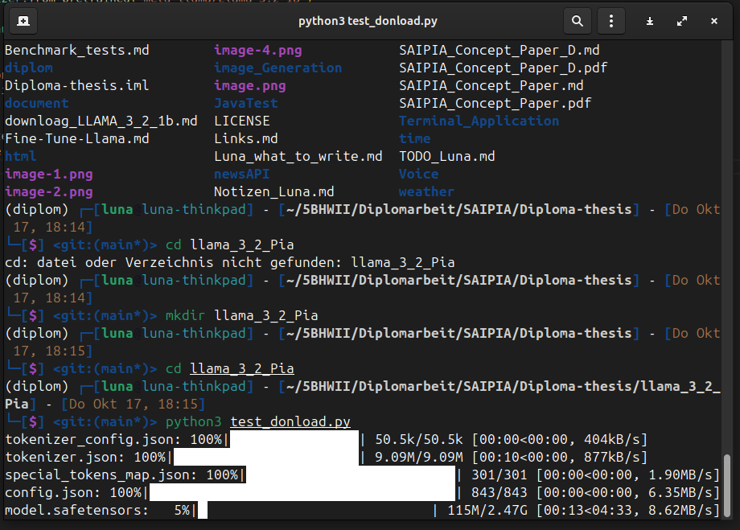
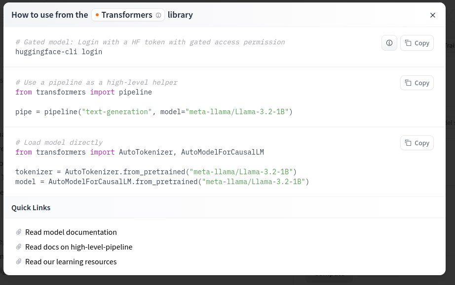

To download you need acount with toke 

login via huggingface-cli
```bash
huggingface-cli login
```

use the token to login 

donload by simply running the following skript 

```python
from transformers import AutoTokenizer, AutoModelForCausalLM

# Load the tokenizer and model
tokenizer = AutoTokenizer.from_pretrained("meta-llama/Llama-3.2-1B")

model = AutoModelForCausalLM.from_pretrained("meta-llama/Llama-3.2-1B")

# Example usage
input_text = "Once upon a time,"
input_ids = tokenizer(input_text, return_tensors="pt").input_ids

# Generate the output
output = model.generate(input_ids, max_length=50, num_return_sequences=1)
print(tokenizer.decode(output[0], skip_special_tokens=True))
```



